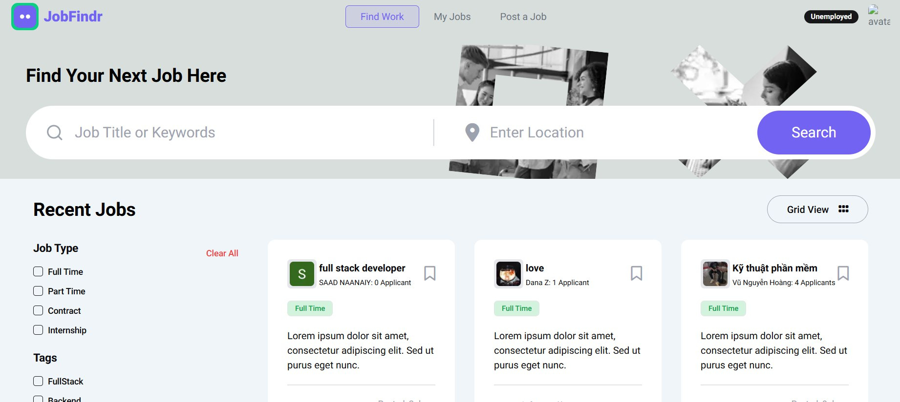

# Job Portal App

  

## Overview

Job Portal App is a **full-stack MERN application** designed to streamline job searching and hiring. Built with **Next.js, React, Express, and MongoDB**, this platform allows job seekers to browse and apply for job listings, while employers can post and manage job offers. The application features secure authentication, dynamic search and filtering, and a responsive UI.

## Tech Stack

### **Frontend:**

- Next.js (React Framework)
- React 18
- Tailwind CSS
- Axios
- Radix UI Components
- Lucide Icons
- React Quill for rich text editing
- Moment.js for date formatting
- TypeScript (optional)

### **Backend:**

- Node.js with Express.js
- MongoDB with Mongoose
- dotenv for environment variables
- CORS for secure API access
- Express OpenID Connect for authentication
- Cookie Parser for session handling

## Features

- 🔐 **Secure Authentication** (Auth0 integration)
- 📄 **Job Posting & Management** (for employers)
- 🔍 **Advanced Job Search & Filtering**
- 💼 **User Dashboard for Applications**
- 📡 **Real-Time Data Fetching** with Axios
- 🎨 **Modern, Responsive UI** with Tailwind CSS

## Installation & Setup

### **1. Clone the repository:**

```sh
git clone https://github.com/yourusername/job-portal-app.git
cd job-portal-app
```

### **2. Backend Setup**

```sh
cd server
npm install
npm run start  # Runs with Nodemon
```

### **3. Frontend Setup**

```sh
cd ../client
npm install
npm run dev
```

The frontend will run on `http://localhost:3000`, and the backend will run on `http://localhost:5000`.

## Environment Variables

Create a `.env` file in the `server` directory and configure your environment variables:

```
PORT=5000
MONGO_URI=your_mongodb_connection_string
AUTH0_CLIENT_ID=your_auth0_client_id
AUTH0_CLIENT_SECRET=your_auth0_client_secret
```

## Folder Structure

```
job-portal-app/
│── server/  # Backend (Express, MongoDB)
│   ├── models/  # Mongoose schemas
│   ├── routes/  # API routes
│   ├── controllers/  # Business logic
│   ├── server.js  # Main backend file
│
│── client/  # Frontend (Next.js, React)
│   ├── components/  # Reusable UI components
│   ├── pages/  # Next.js pages
│   ├── styles/  # Tailwind CSS configurations
│   ├── public/  # Static assets
│   ├── next.config.js  # Next.js configuration
│
│── README.md  # Project documentation
```

## Contributing

Pull requests are welcome. For major changes, please open an issue first to discuss what you would like to change.

## License

This project is open-source and available under the [MIT License](LICENSE).

